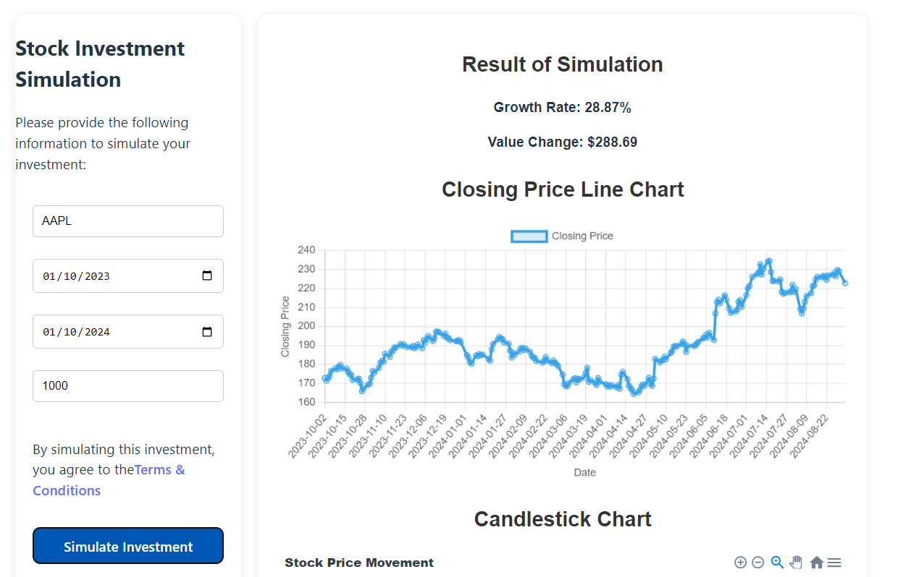

# Stock Simulator Backend

## Project Overview

Stocke Simulator app is an app to simulate growth or decrease rate in percentual of investment in a stock symbol. I’ll provide an exchange chooses from a predefined list of valid exchanges, a stock symbol, system will validate this stock symbol in exchange, start and end investment date and a start value of investment.

So you press simulate button and system get historical data for symbol and get percentage of growth or decrease, start value, end value and value of growth or decrease in value.

This is a separated application or modules to deal with frontend or UI of app and backend API service to frontend.

This project follow best architectural practices like logs, advanced error handling, separeted layers using common design patterns and another best practices as non functional requirements.

This is build with beautiful design system in front end using by example bootstrap UI components and design system. I need place UI and Bsckend validations and field correct formats.

## Backend Architecture
The backend will be built with Flask, featuring:

1. Separation of Concerns: Organized by modules (app.py, config.py, routes.py, simulator.py).
2. Logging and Error Handling: Proper logging and structured error handling.
3. Environment Configurations: Configurations managed through environment variables.
4. Endpoints: REST API endpoints for health check, fetching exchanges, and simulating stock investment.

### Backend Project Structure

```
stock-simulator-backend/
│
├── app.py                # Main entry point for running the app
├── config.py             # Configuration file for environment variables
├── routes.py             # All Flask routes for the API
├── simulator.py          # Core logic for stock simulation
├── requirements.txt      # Python dependencies
└── logs/                 # Directory for logs
    └── app.log           # Log file for application logging
```

## How to Run the Backend Application

### 1. Clone the Repository or Create the Directory:

```bash
mkdir stock-simulator-backend
cd stock-simulator-backend
```

### 2. Create and Activate Virtual Environment:

```bash
python -m venv venv
source venv/bin/activate  # On Windows, use `venv\Scripts\activate`
```

### 3. Install Required Dependencies:

```bash
pip install -r requirements.txt
```

### 4. Run the Backend Server:

```bash
python app.py
```

### 5. Test backend is UP :

The backend API will be accessible at http://localhost:5000. There are a health endpoint at api/health path, so to test call Backend Server plus /health endpoint to check if it is up and running.

```bash
curl https://localhost:5000/api/health
```

## How to run in production

Production Server Setup: Ensure to use a production-grade WSGI server like Gunicorn or uWSGI. Here’s a quick setup for Gunicorn:

```bash
gunicorn app:app --bind 0.0.0.0:5000
```

## Postman collection
We make availablea postman collection and environment at folder /postman to test APIs.

## Frontend
We developed a react frontend app to serve as UI for this backend. The frontend are avaliable at: https://github.com/fnldesign/stock-simulator-frontend



## Contribution Instructions
- Fork the repository.
- Create a branch for your feature or bug fix (git checkout -b feature/nova-feature).
- Commit your changes (git commit -m 'Add new feature').
- Push to the branch (git push origin feature/nova-feature).
- Open a Pull Request.

## License
This project is licensed under the MIT License. See the LICENSE file for more information.

## Contact
If you have any questions or suggestions, feel free to open an issue in the repository or get in touch at fnldesign@hotmail.com.
